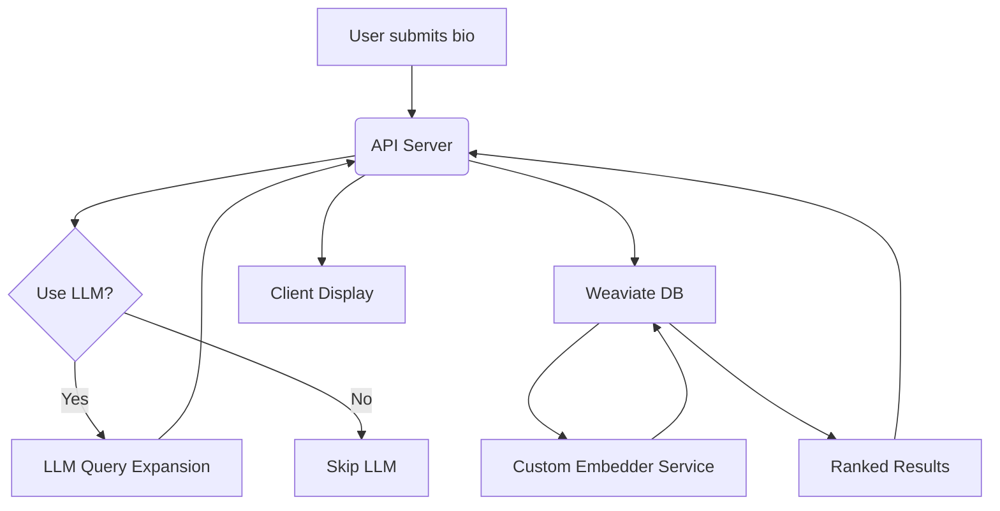

# **Kagi ML Dev Challenge**  

## **🪐 Introduction**  

This project was developed as part of the **Kagi ML Dev Challenge**, with the goal of building an efficient and intuitive system for **query reformulation** and **information retrieval**. The challenge consisted of two main tasks:  

1. **Re-ranking Hacker News stories** based on user interests.  
2. **Query expansion** using a machine learning model to enhance search engine queries.  

### **Key Objectives:**  
- Develop a working API for both tasks.  
- Optimize search relevance and ranking.  
- Achieve sub-100ms latency for query reformulation.  
- Deploy a live demo for real-time testing.  

This repository contains all the code, documentation, and links to both the **live demo** and the **API endpoint** (links to be added later).  

- **[Streamlit Demo](#)**  
- **[API Endpoint](#)**  

---

## **🎯 Main Features**  

- **Hacker News Search API**:  
  - Allows users to search for relevant Hacker News stories based on an input bio.  
  - Users can specify the number of results they want.  
  - Includes an optional **LLM-powered query expansion** feature to enhance searches.  

- **Streamlit Interface for Live Demo**:  
  - A web-based frontend that interacts with the API.  
  - Provides real-time query reformulation and result ranking.  

---

## **🤖 Technologies Used**  

- **Backend & API**:  
  - **Python** for implementation.  
  - **FastAPI** for the API.  
  - **Uvicorn** for asynchronous API serving.  
  - **LangChain** for interacting with LLMs.  
  - **Weaviate Cloud** as a vector database for search.  
  - **OpenAI API** for LLM-powered query expansion.  
  - **Hugging Face Inference API** for embedding generation.  

- **Frontend & Deployment**:  
  - **Streamlit** for the user interface and deployment.  
  - **Render** for API deployment.  

---

## **📍 Development Journey**  

### **Phase 1: Exploring the Hacker News API**  
I started by testing the official **[Hacker News API](https://github.com/HackerNews/API)**, which allows fetching stories by ID or retrieving predefined lists such as the **top 500 stories** or the **most recent ones**.  

To begin experimentation, I downloaded **1,200 stories** using a combination of API calls and stored them locally for initial testing.  

---

### **Phase 2: First Experiments with FAISS**  
I initially tested **semantic similarity search** using **FAISS** as a local vector database.  

- **Why FAISS?**  
  - It offers a great balance between **speed and accuracy**.  
  - It can efficiently handle **high-dimensional** embeddings.  

- **Challenges:**  
  - **Querying 1,200 stories for the top 500 most relevant ones** was ineffective.  
  - The **retrieved results lacked relevance**, indicating that the dataset size was insufficient.  

---

### **Phase 3: Scaling the Dataset**  
To improve retrieval quality, I needed a **larger dataset**.  

Initially, I considered **scraping Hacker News**, but quickly realized this was impractical due to the big quantity of data to download using scraping techniques. Instead, I found an **official dataset** containing **4 million Hacker News posts from 2006 to 2023** ([Hugging Face Dataset](https://huggingface.co/datasets/julien040/hacker-news-posts)).  

- **Data Filtering & Cleaning:**  
  - Removed stories with **HTTP links** (kept only HTTPS).  
  - Removed **duplicates** and **low-score** stories.  
  - Sorted results by **recency** for better ranking.  

---

### **Phase 4: Performance Testing with FAISS (CPU vs. GPU)**  
After integrating the **full dataset**, I ran new FAISS-based searches:  

- **CPU-only FAISS:**  
  - **Pros:** High-quality results.  
  - **Cons:** **2+ seconds per query**—too slow.  

- **GPU-accelerated FAISS (WSL):**  
  - **Pros:** Search time was **cut in half**.  
  - **Cons:** Lower search quality due to **quantization artifacts**.  

This led me to **abandon FAISS in favor of a more scalable solution**.  

---

### **Phase 5: Switching to Weaviate**  
I moved from FAISS to **Weaviate Cloud**, a scalable vector database service.  

- **Initial Issues:**  
  - **Stability problems** with the free-tier plan.  
  - Frequent crashes due to **overloaded indexing**.  

- **Solution:**  
  - Reduced dataset to **300K stories** to improve **indexing performance**.  
  - Optimized queries to balance **search speed (0.2 - 0.7s per request)** and **retrieval quality**.  

---

### **Phase 6: LLM-powered Query Expansion**  
To enhance search relevance, I integrated an **LLM-powered query expansion system** using:  

- **GPT-4o-mini via OpenAI API** for structured output.  
- A custom **LangChain chain** to format queries.  
    - I included a **FewShotPromptTemplate** to provide to the LLM some examples of the task it has to do.

**How it works:**  
- The model expands the user query into **multiple subqueries**.  
- Each subquery is **searched separately**, and results are combined.  
- The system dynamically **adjusts `k` values** to ensure a balanced result set.  

---

### **Phase 7: Streaming for Lower Latency**  
One major issue was **latency**:  

- A **standard DB-only search** took ~**2 seconds**.  
- An **LLM-expanded query** could take **5-15 seconds**.  

**Solution:**  
- **Streamed LLM responses** so users receive partial results **immediately**.  
- **Streamed DB search results** to maintain a smooth experience.

The **overrall response time** has been **decreased** using this method.

---

### **Phase 8: Cloud-based Embedder Deployment**  
Initially, the API **computed embeddings locally**, but this caused **high memory usage**.  

**Problem:**  
- **Render’s free tier (512MB RAM)** was **not enough** to run an embedding model.  

**Solution:**  
- Deployed a **custom embedding API on Hugging Face Inference API**.  
- Created a **custom embedding class** to send requests to this external service instead of computing embeddings locally.  

---

### **Phase 9: Final Deployment**  
I deployed:  
- **Frontend:** On **Streamlit Cloud**.  
- **API:** On **Render**.

---

## **✨ Project Architecture**


The system follows a structured pipeline to process user queries efficiently:  

1. **User Input:** The user submits a bio, which serves as the basis for finding relevant Hacker News stories.  
2. **(Optional) Query Expansion with LLM:**  
   - If query reformulation is enabled, the API server streams the bio to the LLM in real-time.  
   - The LLM generates search-friendly query chunks, which are streamed back to the client while being collected.  
3. **Vector Search with Weaviate:**  
   - Once the query (original or expanded) is ready, the API sends it to the Weaviate database.  
   - Weaviate forwards the query to a custom embedding service to generate the vector representation.  
   - The search engine retrieves the most relevant stories based on vector similarity.  
4. **Response to Client:**  
   - The API server returns the ranked results to the client for display.  

---

## **⚙️ Installation & Setup**
To run the API locally:  

```bash
git clone https://github.com/GiuseppeBellamacina/Kagi-ML-dev-challenge.git
cd kagi-ml-challenge
pip install -r requirements.txt
uvicorn src.main:app --host 0.0.0.0 --port 8000
```

To run Streamlit locally:

```bash
streamlit run src/app.py
```

---

## **📬 API Usage**

`/search`

Example request:  
```json
{
    "user_input": "I like the world of AI research",
    "k": 500
}
```
Example response:  
```json
{
    "results": [
        {"title": "The Future of AI", "url": "https://news.ycombinator.com/item?id=123"},
        ...
    ]
}
```

`/search_llm`

Example request:  
```json
{
    "user_input": "I like the world of AI research",
    "k": 500
}
```
Example response:  
```json
{
    "query": "AI research trends"
    "results": [
        {"title": "The Future of AI", "url": "https://news.ycombinator.com/item?id=123"},
        ...
    ]
}
```
---
